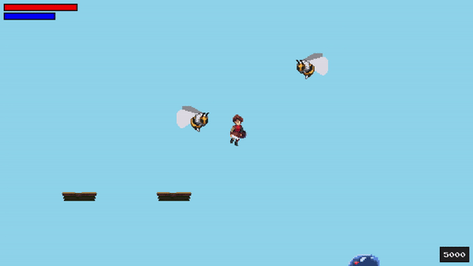


# Um jogo inspirado em castlevania feito no Pygame

## Demonstração:

## Características:

### Versão BetaV0.03

<ul>
<li>Uma fase teste</li>
<li>Configuração de botão do teclado</li>
<li>Suporte a joystick(experimental)</li>
</ul>

## Lista de Comandos:

    Em options > keyboard você pode conferir os comandos padrões e modifica-los

    Ataque Básico   = "Attack"
    Magia de Fogo   = "Magic"
    Magia de Cura   = "UP" + "Magic"
    Pulo            = "Jump"
    Pulo Duplo      = "Jump" no Ar 
    Divekick        = "Down" durante o Pulo Duplo
    Backdash        = "Dodge"
    Menu            = "Start"
    Menu de upgrade = "Select"
    
## Mecanicas:

<ul>
<li>Ao acertar um "Divekick" em um inimigo você é lançado para cima(dependo do tempo que segura o "Jump") e recupera o pulo duplo</li>
<li>É possível cancelar o "Ataque Básico" em um "Backdash"</li>
<li>É possível cancelar o "Backdash" apertando "Down"</li>
<li>É possível deslizar na parede segurando na direção dela</li>
<li>No "menu de upgrade" é possível gastar a experiência acumulada para melhorar seus atributos</li>
</ul>

## Instruções de uso:
    
        Extrair o executável.zip e iniciar pelo deadvania.exe
  

